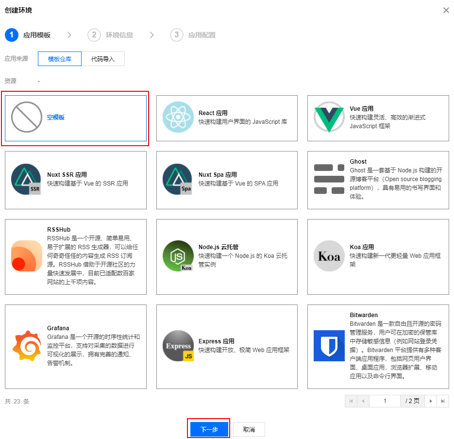
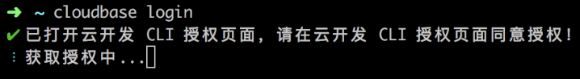
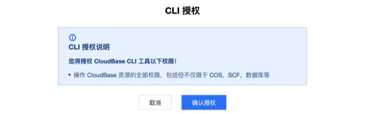
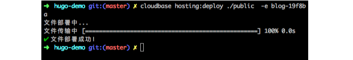
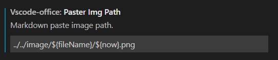
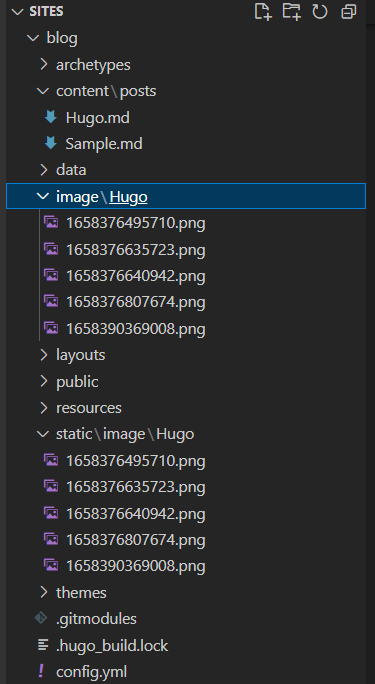

# 部署 Hugo 记录

Hugo 是静态网页生成器，本文记录用 Hugo 和腾讯云静态托管创建个人博客

> A Fast and Flexible Static Site Generator built with love by bep, spf13 and friends in Go.

参考资料

1. [Github](https://github.com/gohugoio/hugo)
2. [几个常见博客的对比](https://blog.laoda.de/archives/blog-choosing)
3. [Hugo 文档：quikstart](https://gohugo.io/getting-started/quick-start/)
4. [腾讯云静态网站托管部署 Hugo](https://cloud.tencent.com/document/product/1210/43389)

环境
hugo v0.101.0-466fa43c16709b4483689930a4f9ac8add5c9f66 windows/amd64 BuildDate=2022-06-16T07:09:16Z VendorInfo=gohugoio

## Hugo

### 安装

[文档](https://gohugo.io/getting-started/installing/)

假设使用文件夹 C:\Hugo 作为目录
创建文件夹 C:\Hugo\bin 存放[压缩包](https://github.com/gohugoio/hugo/releases)
创建 C:\Hugo\Sites 作为新项目起点
设置环境变量

```bash
set PATH=%PATH%;C:\Hugo\bin
```

检查 hugo 命令是否可以使用

### 创建新 Site

```bash
cd C:\Hugo\Sites
hugo new site quickstart
```

### 添加主题

[主题站](https://themes.gohugo.io/)

```bash
cd quickstart
git init
git submodule add https://github.com/theNewDynamic/gohugo-theme-ananke.git themes/ananke

echo theme = "ananke" >> config.toml
```

### 添加文章

```bash
hugo new posts/my-first-post.md
```

### 启动本地 Hugo 服务

```bash
hugo server -D
```

Navigate to your new site at http://localhost:1313/.
具体端口看日志

### 构建静态页

```bash
hugo -D
```

Output will be in ./public/ directory by default (-d/--destination flag to change it, or set publishdir in the config file).

## 腾讯云 静态托管部署

1. 登录 [云开发控制台](https://console.cloud.tencent.com/tcb/env/index)，单击新建，选择空模板，单击下一步，填写环境名称并开通“按量计费”环境。
   

开通环境以后，进入 [环境概览](https://console.cloud.tencent.com/tcb/env/overview) 页面请记住您的<a id="envid">环境 Id</a>，这个 ID 后续部署需要用到。 2. 在本地安装 Node.js。如未安装请前往 Node.js 官网 [下载安装](https://nodejs.org/)，并确保 Node.js 安装成功。 3. 打开命令提示符，执行以下命令安装 cloudbase cli：

```bash
npm install -g @cloudbase/cli
```

4. 执行以下登录命令登录云开发：

```bash
tcb login
```

登录成功如下图所示：
 5. 在弹出的页面中单击确认授权进行授权：
 6. 执行以下命令，在 hugo-site 中部署 public 目录中的文件：

```bash
cloudbase hosting deploy ./public  -e EnvID
```

cloudbase hosting deploy ./public -e EnvID
此处的 EnvID 替换为上述 [步骤](#envid) 创建好的环境 ID。
 7. 登录 [云开发控制台](https://console.cloud.tencent.com/tcb/env/index)，进入 [静态网站托管](https://console.cloud.tencent.com/tcb/hosting/index) 页面，可以找到默认的域名，单击域名，即可看到您刚部署的 Hugo。

## Github托管

[文档](https://gohugo.io/hosting-and-deployment/hosting-on-github/)

[参考]https://zhuanlan.zhihu.com/p/57361697

[githubpage](https://pages.github.com/)
[配置](https://frankccccc.github.io/blog/posts/move_blog/)

1. 新建Github组织orgName, 仓库orgName.github.io
2. github仓库setting->page页面可以修改分支和仓库位置
3. 将public文件夹转换为git仓库，并推送，用githubdesk操作
4. 访问https://orgName.github.io/


## 自定义

### 使用 blog 为网站名

```bash
cd C:\Hugo\Sites
```

```bash
hugo new site blog
cd blog
```

### 更换主题

https://themes.gohugo.io/themes/hugo-papermod/
https://adityatelange.github.io/hugo-PaperMod/

```bash
# 把这篇文章放进去
hugo new posts/Hugo.md
# 启动本地Hugo服务
hugo server -D
# 构建静态页
hugo -D
```

### 换行符问题

Hugo 使用 BlackFriday 把 markdown 转换为 HTML，可以在 Hugo 的配置文件中添加以下设置，将换行符强制输出为硬换行。

```toml
blackfriday:
  extensions: ["hardLineBreak"]
```

```yml
blackfriday:
    extensions: ["hardLineBreak"]
```

### 本地图片问题

如何让 Hugo 和本地都能正常显示本地图片，且本地插入图片只需要复制
编辑器以 vscode 为例

[参考](https://blog.dontjudge.cn/post/hugo-%E9%9D%99%E6%80%81%E7%BD%91%E7%AB%99%E5%9B%BE%E7%89%87%E6%8F%92%E5%85%A5/)

1. hugo 的 static 文件夹下会被打包，文章 markdown 文件构建后位置在 public/content/post/your-post-name 文件夹下
2. 如果 static 下防止 image/my-image.png 图片，文章打包后引用到图片有两种方式

-   /image/my-image.png
-   ../../image/my-image.png

3. 本地安装插件"cweijan.vscode-office"，用于图片自动复制到本地，路径配置为如下格式
   
   用../../image/my-image.png 形式是因为/image/my-image.png 会上传到意外的路径
4. 链接本地目录和 static 目录
   创建好.\static\image 目录(真实目录，Hugo 的 static 不能是软链接)
   通过软链接创建.\image 目录

```bash
cd blog
mklink .\image .\static\image /J
```

完成后目录结构如下


问题：Hugo 支持层级目录，vscode 插件还未找到如何配置

### 写在最后

Hugo优点
1. 静态页可以避免服务器风险
2. 能使用本地图片

但目前存在一系列问题
1. MarkDown解释器的软换行配置不生效
2. 能使用本地图片，但却存在限制
3. 没有图形界面，使用太过耗时
4. 表头会污染MarkDown源文件
5. 腾讯云部署域名必须备案，配置短链不可行
6. MarkDown语法支持有限，如常用的图片标签
